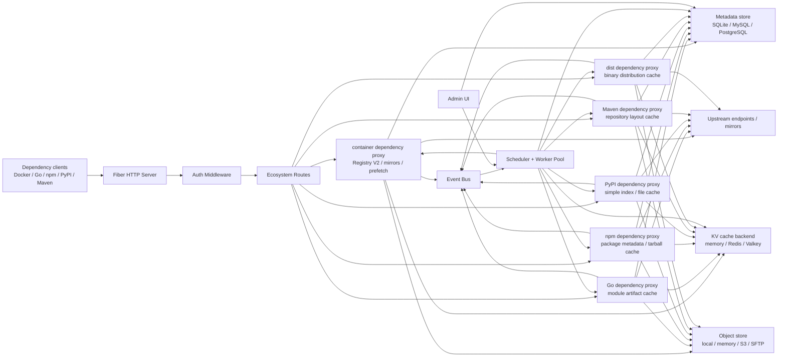
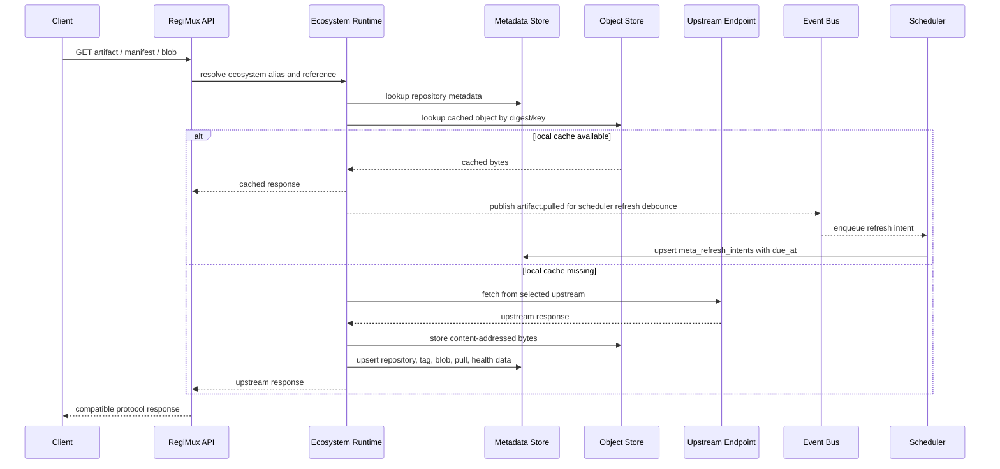
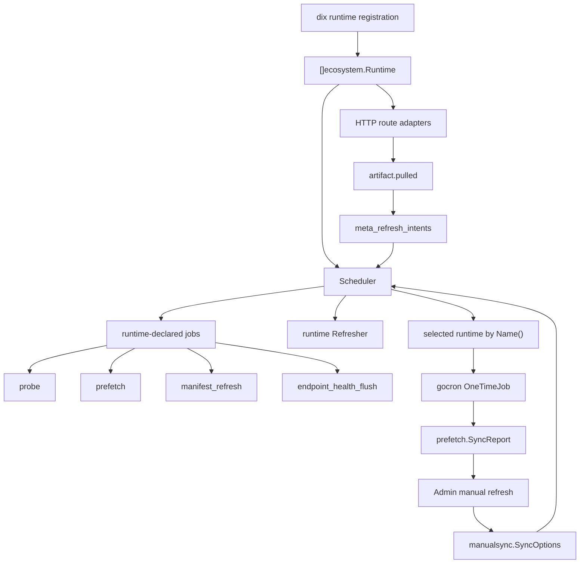
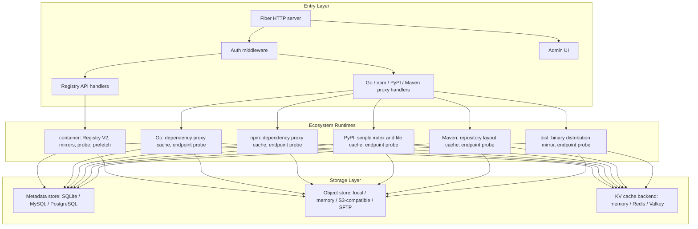

# Design

## Positioning

RegiMux is a read-only dependency proxy for development and CI environments. It gives build clients one local dependency endpoint, then routes each request to the configured upstream registry, module proxy, package index, or repository while caching reusable artifacts locally.

Container registry, Go modules, npm, PyPI, Maven, and dist binary distribution mirrors are first-class dependency ecosystems. Configuration is split by ecosystem through `container`, `go`, `npm`, `pypi`, `maven`, and `dist` blocks, and each ecosystem owns its endpoint service and runtime implementation under `internal/ecosystems/*`.

The container ecosystem exposes a Registry-compatible pull API and routes requests to configured upstream registries by container alias. Go, npm, PyPI, Maven, and dist expose read-through proxy cache APIs under their own path prefixes and route requests to upstreams configured in their matching ecosystem blocks.

RegiMux is intentionally read-only. Upload, publish, manifest write, package deletion, and push registry APIs are out of scope; the product boundary is dependency resolution, caching, metadata accounting, and background maintenance.

## Architecture Overview



## OCI Request Model

For containers, RegiMux acts as a Registry-compatible dependency proxy. Image names use the first repository path segment as the container alias:

```text
localhost:8080/{containerAlias}/library/alpine:latest
localhost:8080/{containerAlias}/org/app:v1.2.3
```

Registry API examples:

```text
GET /v2/{containerAlias}/library/alpine/manifests/latest
GET /v2/{containerAlias}/library/alpine/blobs/sha256:...
GET /v2/{containerAlias}/library/alpine/tags/list
GET /v2/{containerAlias}/library/alpine/referrers/sha256:...
```

The container alias is resolved from the `container` block. The rest of the path is passed to the selected upstream registry.

## Go Module Proxy Request Model

For Go, RegiMux acts as a Go module dependency proxy. Go upstreams are configured under the `go` ecosystem block:

```hcl
go {
  default {
    registry = "https://proxy.golang.org"
  }
}
```

Clients use:

```bash
GOPROXY=http://localhost:8080/go/{goAlias},direct
```

Go proxy API examples:

```text
GET /go/{goAlias}/github.com/pkg/errors/@v/list
GET /go/{goAlias}/github.com/pkg/errors/@v/v0.9.1.info
GET /go/{goAlias}/github.com/pkg/errors/@v/v0.9.1.mod
GET /go/{goAlias}/github.com/pkg/errors/@v/v0.9.1.zip
GET /go/{goAlias}/github.com/pkg/errors/@latest
```

The Go alias is resolved only within the `go` block. It does not share a namespace with container, npm, PyPI, Maven, or dist aliases.

`@latest` and `@v/list` use a short TTL. Versioned `.info`, `.mod`, and `.zip` responses are stored in object storage by content sha256, with metadata mapping module/reference to digest. The current implementation does not proxy `sum.golang.org` and does not perform VCS direct fetching.

## Read-through Cache Flow



## Other Ecosystem Prefixes

npm, PyPI, Maven, and dist are first-class dependency proxy ecosystems with independent alias namespaces under their own path prefixes:

```text
GET /npm/{npmAlias}/...
GET /pypi/{pypiAlias}/...
GET /maven/{mavenAlias}/...
GET /dist/{distAlias}/...
```

## Ecosystem Runtime Abstraction

Registry, mirror, probe, and prefetch behavior is exposed through ecosystem runtimes instead of being hard-coded into the scheduler. Each runtime owns the protocol details for one ecosystem, advertises the capabilities and jobs it supports, and is registered through `dix`.

Ecosystem implementations live under `internal/ecosystems/*`:

- `internal/ecosystems/container`
- `internal/ecosystems/golang`
- `internal/ecosystems/npm`
- `internal/ecosystems/pypi`
- `internal/ecosystems/maven`
- `internal/ecosystems/dist`

The scheduler consumes the runtime set from `dix` and registers background work from `ecosystem.JobProvider` / `ecosystem.JobSpec`:

- `probe`: discover endpoint health and latency for aliases that configure mirror probing.
- `prefetch`: warm likely future artifacts through the same cache path used by client requests.
- `manifest_refresh`: refresh manifest metadata without forcing blob downloads where the ecosystem supports that distinction.
- `endpoint_health_flush`: persist buffered endpoint health state for runtimes that maintain a hot health layer.

The scheduler also subscribes to `artifact.pulled`. This path is not a periodic job declared by one ecosystem; it is a lightweight response to recent client pull activity. Services only publish refresh intent. The scheduler persists that intent in SQL metadata, and a shared drain job consumes due intents later.

Current capability coverage is intentionally uneven. The container runtime supports predictive `prefetch` because OCI pulls already depend on mirror scoring and manifest/blob warming. Go, npm, PyPI, Maven, and dist support the shared endpoint `probe` capability and recent-pull `prefetch` rewarming through the same runtime registration boundary; ecosystem-specific version prediction can be added without changing scheduler wiring.

Go, npm, PyPI, Maven, and dist still own their protocol details in their ecosystem packages, but share lightweight `internal/depruntime` glue for repeated runtime wiring: upstream mapping, runtime-declared jobs, manual refresh job wrappers, and prefetch/refresh response draining. Route parsing, cache keys, upstream requests, content rewriting, and refresh mode selection stay inside each ecosystem service so protocol differences do not leak into the scheduler or shared glue.

Manual refresh is also standardized in the same abstraction:

- Admin submits `manualsync.SyncOptions` with `(ecosystem, alias, repo, reference)`.
- Scheduler selects the ecosystem runtime by `runtime.Name()` and submits a one-time background job via `SubmitSync`.
- A runtime that supports manual refresh exposes `CreateSyncJob`, `RunSyncJob`, `SyncJob`, and `MarkSyncJobFailed`.
- Manual refresh execution is isolated per ecosystem runtime but observed through shared scheduler metrics and admin job polling.
- Job lifecycle is in-memory today (in a concurrent map); results are returned from the scheduler endpoint and UI polling.

Because this is the same runtime boundary, adding a new ecosystem requires only:

1. implementing `ecosystem.Runtime` plus relevant capability interfaces (`Probe`, `Prefetch`, manual refresh, `JobProvider`).
2. registering it in `dix` with a stable key.
3. no changes to scheduler orchestration code.



## Main Components



Background services run through the scheduler and worker pool:

- cache cleanup and capacity control
- runtime-declared mirror probing
- runtime-declared predictive prefetch and manifest refresh
- distributed locks when Redis or Valkey is configured
- Redis/Valkey endpoint health hot state when a remote cache backend is configured
- distributed cache-fill leases for artifact and container blob fills when Redis or Valkey is configured

## Metadata Model

The metadata layer is SQL-backed and implemented with `dbx` repositories. Supported drivers:

- SQLite
- MySQL
- PostgreSQL

Metadata is organized around repository-style interfaces:

- catalog metadata for upstreams and repositories
- manifests and tags
- blobs and repository-to-blob links
- pull records
- endpoint health
- recent-pull refresh intent queue
- prefetch runs, outcomes, and controls
- aggregate read model for admin and stats

Endpoint health is durable in SQL. When Redis or Valkey is configured as the cache backend, probe updates are also written to a shared hot state layer so replicas can avoid cold-starting endpoint scores and can share low-latency mirror ranking quickly.

`meta_refresh_intents` is the distributed deduplication queue for recent-pull refresh. Its unique key is `(ecosystem, kind, alias, repository, reference, accept)`. The first event writes `due_at = now + scheduler.refresh.window`; duplicate events inside the window only update `last_seen_at` and the skipped counter, and do not push `due_at` later. The drain job reads due intents and claims work by deleting the row; only the instance that successfully deletes the row runs the matching runtime `Refresher`.

Metadata rows and schemas model domain values directly. Low-cardinality fields such as refresh intent `ecosystem` and `kind` use custom Go types, with row tags declaring `dbx:"...,codec=text"` and schema columns using the same custom type plus `type=text`. The `mapper` layer is reserved for record/row structural mapping and a small set of non-DB encoding conversions; SQL scan/encode conversion belongs to dbx codecs.

SQL repositories use typed `dbx/repository` patch APIs (`PatchSet`, `KeySet`, `Part`) for simple key updates, with shared helpers for the repeated “update by key + wrap error” pattern. Upsert is not the default for rows keyed by non-primary unique keys because it widens cross-database behavior and can overwrite internal id/timestamp fields that should remain stable.

The SQL implementation is named `SQLStore`. SQLite-specific path, DSN, and pragma logic is isolated under the SQLite driver helper.

## Object Model

Blob objects are stored separately from metadata. The object store can be:

- local filesystem
- memory
- S3-compatible storage
- SFTP

Object keys are content-addressed where possible. Metadata remains the source of truth for whether an object is available for a repository.

## Cache Behavior

Client-facing requests use cache-first semantics: if RegiMux can open a local cached object, it returns that object immediately. TTL expiry does not block the client request on upstream validation. TTL marks cached records stale for observability; scheduled refresh is driven by background job cadence and recent pull history. A client request reaches upstream synchronously only when the matching local cache object is absent.

Background refresh paths include scheduled `prefetch` / `manifest_refresh` jobs, recent-pull refresh debounce, and Admin manual refresh. Cache hits and stale hits publish `artifact.pulled`; the scheduler stores refresh intents in `meta_refresh_intents`, deduplicates them per artifact for `scheduler.refresh.window` (10 minutes by default), then drains due intents through the runtime `Refresher` capability. Background refresh paths use explicit refresh requests, may bypass the local-first rule, contact upstream directly, and update local metadata and object cache when upstream content changed.

Recent-pull debounce is a per-artifact window, not a one-time job per pull. If the same `alpine:latest` is pulled 100 times in 10 minutes, the SQL queue keeps one due refresh intent. After that window expires and the intent is consumed, a later pull can create the next refresh intent.

Manifests are cached with an `Accept`-aware key because different clients may ask for different manifest media types for the same tag.

Blob caching is content-addressed by digest. Before returning a cached blob, RegiMux still checks that the requested repository is allowed to reference the digest.

Tags and referrers are cached with TTLs and upstream revalidation.

The container runtime coalesces concurrent work for same-key upstream tokens, manifests, blob store operations, and tag index building with typed `singleflightx`, reducing duplicate upstream work and removing runtime type assertions. The protocol-specific paths still own key composition: manifest keys keep the `Accept` dimension, and blob responses still verify repository-to-blob membership before serving cached content.

Go, npm, PyPI, Maven, and dist immutable response caching share `internal/artifactcache.Store`. This component packages metadata, object storage, and `FillTracker` as an injectable cache service; each ecosystem still owns its route parsing, cache keys, upstream requests, and content rewriting. `FillTracker` uses a `collectionx` concurrent map in-process to coalesce same-key fills and avoid duplicate upstream fetches inside one replica.

When `cache.backend` is Redis or Valkey, `internal/cache/backend.LeaseBackend` provides distributed leases. The first replica that acquires a lease fetches upstream and commits object/metadata; other replicas wait until the committed object appears in the shared object store, then return a cache hit. The lease only coordinates concurrent fills. It does not replace SQL metadata or object storage. Multi-replica deployments still need shared MySQL/PostgreSQL metadata and shared S3/SFTP object storage.

Container blob streaming uses the same lease shape with a different execution model: the owner replica holds the blob-fill lease while it streams from upstream to the client and writes the same bytes into object storage. Other replicas wait until the owner commits blob metadata, then read from the shared object store. Range misses also wait for the full blob fill and then serve the requested slice from the local object. If Redis/Valkey is unavailable, RegiMux keeps local coalescing and remains available, but separate replicas may duplicate upstream fetches.

## Mirror Scheduling

One container alias may have multiple mirrors. The container runtime advertises the `probe` capability when probing is enabled for an alias. Blob fetches can use latency-aware selection:

- probes update endpoint latency and health
- successful endpoints are preferred
- failing endpoints enter cooldown windows
- content mismatch can temporarily downgrade a mirror

Client-side layer concurrency already exists in Docker/containerd, so RegiMux focuses on selecting better mirrors and avoiding slow or unhealthy endpoints.

## Prefetch

Container prefetch predicts likely next tags based on pull history, then warms manifests and blobs through the normal cache path. Dependency ecosystem prefetch currently rewinds recent pull history and refreshes the exact Go/npm/PyPI/Maven artifact through that ecosystem's proxy cache path. The scheduler invokes both through the runtime `prefetch` capability, so ecosystem-specific version prediction can be added behind the same job shape. Runs and outcomes are stored in metadata and shown in Admin UI.

Manual refresh and scheduler prefetch share the same job abstraction:

- Prefetch jobs are periodic and periodicity is configured by `scheduler.prefetch`.
- Manual refresh jobs are one-time and triggered via `/admin/sync` (form submit) and submitted as gocron `OneTimeJob`.
- Both produce `prefetch.SyncReport`-style outcomes and can be observed by admin endpoints and shared metrics.

Prefetch supports:

- byte budget
- task budget
- repository limit
- failure backoff
- retry window
- admin cancel/retry controls

## Authentication

When enabled, RegiMux supports Docker Registry authentication flow and `docker login`. Users are configured locally. Each user can be scoped to repository patterns such as:

```text
{containerAlias}/*
{containerAlias}/my-org/*
```

Admin UI reuses the same configured users and is protected with HTTP Basic when auth is enabled.

## Dependency Injection

The application is assembled with `dix`.

Important lifecycle decisions:

- logger, config, auth, scheduler, worker, admin, store, cache backend, and artifact cache are shared modules; container-owned upstream, registry tooling, suggestion, and Docker daemon integration live under the container ecosystem module set
- ecosystem runtime implementations are registered with `dix`; the scheduler consumes the registered runtime set rather than importing per-ecosystem handlers
- metadata mapper is a DI singleton
- `*dbx.DB` is managed by DI lifecycle and closed on stop
- SQL repositories are composed into a `meta.Store` facade while narrower repository interfaces are exposed for future consumers

## Non-goals

- no push/write Registry support
- no blob upload API
- no manifest PUT API
- no delete API
