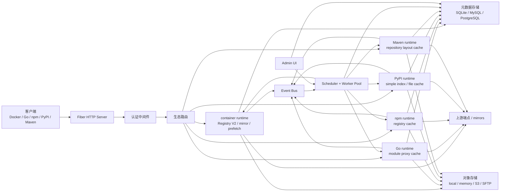
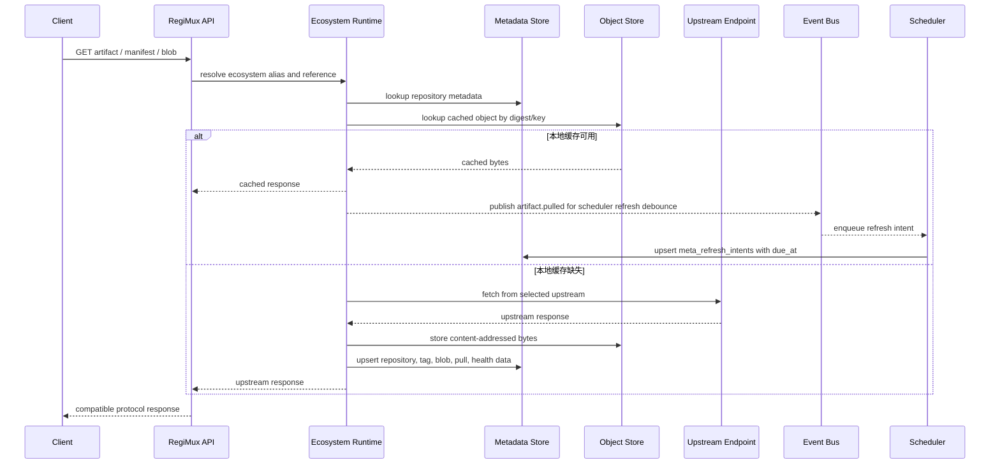
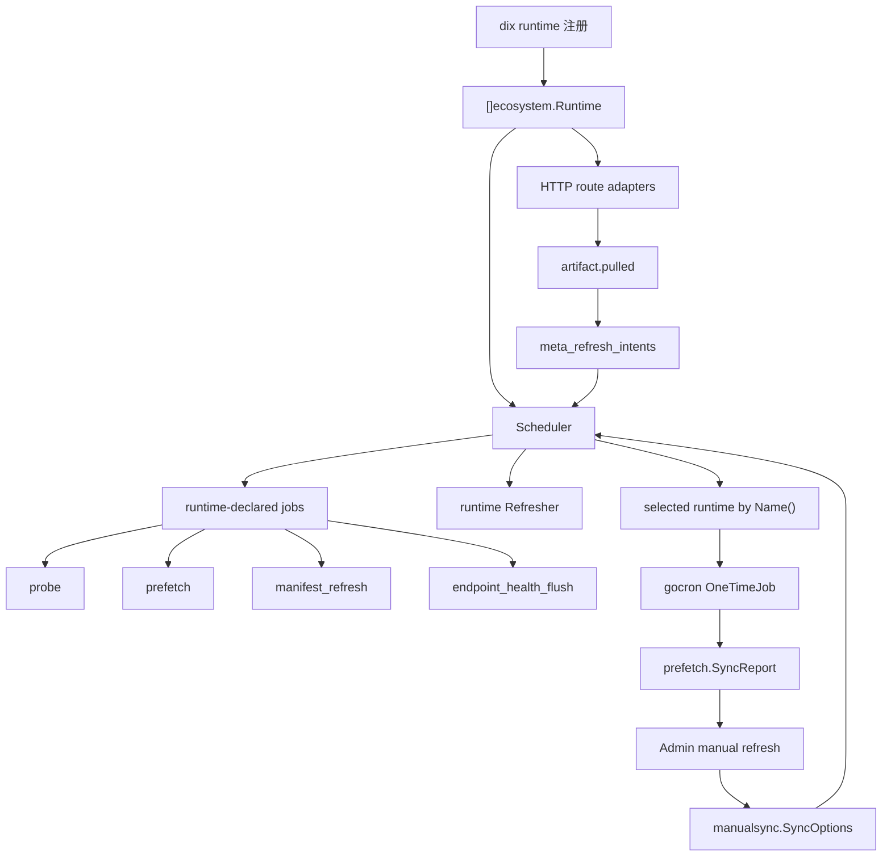
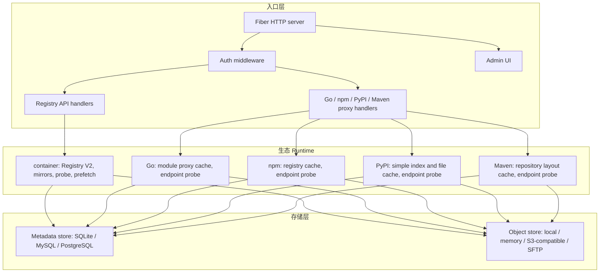

# 设计

## 定位

RegiMux 是一个只读研发依赖缓存网关。container registry、Go、npm、PyPI 和 Maven 都是一等生态。配置按生态拆分为 `container`、`go`、`npm`、`pypi` 和 `maven` 块，各生态在 `internal/ecosystems/*` 下维护自己的 endpoint service 和 runtime 实现。

container 生态对外暴露兼容 Registry 的 pull API，并通过 container alias 将请求路由到不同上游 registry。Go、npm、PyPI 和 Maven 生态分别在自己的路径前缀下暴露 read-through proxy cache API，并将请求路由到对应生态配置块里的上游。

RegiMux 不是 push registry。上传、manifest 写入和删除 API 当前都不在范围内。

## 架构概览



## OCI 请求模型

镜像名使用仓库路径的第一段作为 container alias：

```text
localhost:5000/{containerAlias}/library/alpine:latest
localhost:5000/{containerAlias}/org/app:v1.2.3
```

Registry API 示例：

```text
GET /v2/{containerAlias}/library/alpine/manifests/latest
GET /v2/{containerAlias}/library/alpine/blobs/sha256:...
GET /v2/{containerAlias}/library/alpine/tags/list
GET /v2/{containerAlias}/library/alpine/referrers/sha256:...
```

container alias 从 `container` 配置块解析，剩余路径会传递给对应上游 registry。

## Go Module Proxy 请求模型

Go upstream 放在 `go` 生态配置块下：

```hcl
go {
  default {
    registry = "https://proxy.golang.org"
  }
}
```

客户端使用：

```bash
GOPROXY=http://localhost:5000/go/{goAlias},direct
```

Go proxy API 示例：

```text
GET /go/{goAlias}/github.com/pkg/errors/@v/list
GET /go/{goAlias}/github.com/pkg/errors/@v/v0.9.1.info
GET /go/{goAlias}/github.com/pkg/errors/@v/v0.9.1.mod
GET /go/{goAlias}/github.com/pkg/errors/@v/v0.9.1.zip
GET /go/{goAlias}/github.com/pkg/errors/@latest
```

Go alias 只在 `go` 配置块内解析，不与 container、npm、PyPI 或 Maven alias 共享命名空间。

`@latest` 和 `@v/list` 使用短 TTL。版本化 `.info`、`.mod` 和 `.zip` 响应按内容 sha256 写入对象存储，并用元数据记录 module/reference 到 digest 的映射。当前不代理 `sum.golang.org`，也不做 VCS direct 拉取。

## Read-through Cache 流程



## 其他生态路径前缀

npm、PyPI 和 Maven 都是一等 read-through proxy 生态，并使用各自独立的 alias 命名空间：

```text
GET /npm/{npmAlias}/...
GET /pypi/{pypiAlias}/...
GET /maven/{mavenAlias}/...
```

## 生态 Runtime 抽象

registry、mirror、probe 和 prefetch 等跨生态能力通过生态 runtime 暴露，而不是写死在调度器里。每个 runtime 负责一个生态的协议细节，声明自己支持的 capability 和 job，并通过 `dix` 注册。

生态实现位于 `internal/ecosystems/*`：

- `internal/ecosystems/container`
- `internal/ecosystems/golang`
- `internal/ecosystems/npm`
- `internal/ecosystems/pypi`
- `internal/ecosystems/maven`

调度器通过 `dix` 获取 runtime 集合，并按 `ecosystem.JobProvider` / `ecosystem.JobSpec` 注册后台任务：

- `probe`：对配置了 mirror 探测的 alias 采集 endpoint 健康状态和延迟。
- `prefetch`：沿用客户端请求的缓存路径，预热可能即将访问的制品。
- `manifest_refresh`：在生态支持区分 manifest/blob 的情况下只刷新 manifest 元数据。
- `endpoint_health_flush`：持久化 runtime 内部缓冲的 endpoint 健康状态。

除此之外，调度器还订阅 `artifact.pulled` 事件。这个路径不是某个生态声明的周期任务，而是对客户端近期拉取行为的轻量响应：service 只发布刷新意图，调度器把意图持久化到 SQL 元数据，再由统一的 drain job 到期消费。

当前 capability 覆盖有意保持不对称。container runtime 支持预测性 `prefetch`，因为 OCI 拉取已经依赖 mirror 打分以及 manifest/blob 预热。Go、npm、PyPI 和 Maven 支持通用 endpoint `probe` capability，也通过同一 runtime 注册边界支持 recent-pull `prefetch` rewarm；后续增加各生态自己的版本预测时不需要改调度器装配。

手动刷新也走同一套运行时抽象：

- Admin 提交 `(ecosystem, alias, repo, reference)` 到 `manualsync.SyncOptions`。
- Scheduler 按 `runtime.Name()` 选择对应生态 runtime，并通过 `SubmitSync` 提交一次性后台任务。
- 支持手动刷新的 runtime 会暴露 `CreateSyncJob`、`RunSyncJob`、`SyncJob`、`MarkSyncJobFailed`。
- 手动刷新执行被 runtime 隔离，同时由统一的调度器指标和 Admin 任务轮询观察。
- 作业状态当前保存在内存并发映射中（不持久化到数据库），结果由 admin 接口查询并展示。

因此新增一个生态通常只需要：

1. 实现 `ecosystem.Runtime` 及其相关 capability 接口（`Probe` / `Prefetch` / 手动刷新 / `JobProvider`）。
2. 在 `dix` 中注册该 runtime（使用稳定 key）。
3. 不需要改调度器主流程。



## 主要组件



后台服务通过调度器和 worker 池运行：

- 缓存清理和容量控制
- 由 runtime 声明的 mirror 探测
- 由 runtime 声明的预测预拉取和 manifest refresh
- 配置 Redis 或 Valkey 时使用分布式锁
- 配置远程 cache backend 时使用 Redis/Valkey endpoint 健康热状态

## 元数据模型

元数据层基于 SQL，并使用 `dbx` repository 实现。支持驱动：

- SQLite
- MySQL
- PostgreSQL

元数据围绕 repository 风格接口组织：

- 上游和仓库 catalog 元数据
- manifest 和 tag
- blob 和 repository-to-blob 关系
- pull 记录
- endpoint 健康状态
- recent-pull refresh intent 队列
- 预拉取运行、结果和控制
- Admin UI 和统计使用的聚合读模型

endpoint 健康状态以 SQL 为持久化事实来源。cache backend 配置为 Redis 或 Valkey 时，probe 更新也会写入共享热状态层，让多个副本避免 endpoint score 冷启动，并更快共享低延迟 mirror 排序。

`meta_refresh_intents` 是 recent-pull 刷新的分布式去重队列。唯一 key 由 `(ecosystem, kind, alias, repository, reference, accept)` 组成；第一次事件写入 `due_at = now + scheduler.refresh.window`，窗口内重复事件只更新 `last_seen_at` 和跳过计数，不推迟 `due_at`。drain job 查询到期 intent，并通过删除记录完成 claim；只有成功删除记录的实例会执行对应 runtime 的 `Refresher`。

元数据 row 和 schema 直接表达领域类型。低基数字段如 refresh intent 的 `ecosystem`、`kind` 使用自定义类型，并在 row tag 上声明 `dbx:"...,codec=text"`，schema column 使用对应自定义类型和 `type=text`。`mapper` 只负责 record 与 row 的结构映射和少量非 DB 编码转换，不承载 SQL scan/encode codec。

SQL 实现命名为 `SQLStore`。SQLite 特有的路径、DSN 和 pragma 逻辑被隔离在 SQLite driver helper 中。

## 对象模型

blob 对象和元数据分开保存。对象存储可以是：

- 本地文件系统
- memory
- S3 兼容存储
- SFTP

对象 key 尽量按内容寻址。某个对象是否可被某个仓库引用，仍以元数据为准。

## 缓存行为

用户请求链路采用 cache-first 语义：只要本地已经有可打开的缓存对象，就直接回写客户端；TTL 过期不会在用户请求里阻塞等待上游校验。TTL 只用于把缓存记录标记为 stale，便于观察；后台刷新由定时任务节奏和近期 pull history 驱动。只有本地完全没有对应缓存时，用户请求才会同步访问上游并补齐缓存。

后台刷新路径包括定时 `prefetch` / `manifest_refresh` 任务、recent-pull refresh debounce，以及 Admin 手动刷新。缓存命中和 stale 命中会发布 `artifact.pulled`；scheduler 把刷新意图写入 `meta_refresh_intents`，按制品用 `scheduler.refresh.window` 去重（默认 10 分钟），到期后通过 runtime 的 `Refresher` capability 消费。后台刷新路径通过显式 refresh 请求绕过本地优先规则，主动访问上游并在内容变化时更新本地元数据和对象缓存。

recent-pull debounce 是按制品窗口触发，不是每次 pull 创建一个一次性任务。比如 10 分钟内同一个 `alpine:latest` 被拉取 100 次，SQL 队列里只保留一个到期刷新 intent；窗口到期且 intent 被消费后，后续新的 pull 才会创建下一轮刷新 intent。

manifest 缓存 key 会包含 `Accept` 信息，因为同一个 tag 可能根据客户端请求返回不同 manifest media type。

blob 缓存按 digest 内容寻址。返回缓存 blob 前，RegiMux 仍会检查目标仓库是否允许引用该 digest。

tag 和 referrers 使用 TTL，并会通过上游重新校验。

## Mirror 调度

一个 container alias 可以配置多个 mirror。container runtime 会在 alias 启用探测时声明 `probe` capability。blob 拉取可以使用基于延迟的选择策略：

- probe 更新 endpoint 延迟和健康状态
- 优先选择成功且健康的 endpoint
- 失败 endpoint 进入冷却窗口
- 内容不一致会临时降低 mirror 优先级

Docker/containerd 客户端本身已经会并发拉取 layer，所以 RegiMux 重点放在选择更好的 mirror、避开慢或不健康的 endpoint。

## 预拉取

container 预拉取会基于拉取历史预测可能的后续 tag，然后通过正常缓存路径预热 manifest 和 blob。依赖生态 prefetch 当前会回放近期 pull history，并通过对应生态 proxy 缓存路径刷新完全相同的 Go/npm/PyPI/Maven 制品。调度器通过 runtime 的 `prefetch` capability 调用这两类任务，因此后续可以在同一种任务形态后面补各生态自己的版本预测逻辑。运行记录和结果会存入元数据，并展示在 Admin UI。

手动刷新与定时预拉取共享同一类任务模型：

- 预拉取由 `scheduler.prefetch` 周期任务驱动；
- 手动刷新由 Admin 页面 `/admin/sync` 表单触发后，通过 gocron 的 `OneTimeJob` 立即运行；
- 两者都产出 `prefetch.SyncReport` 语义的结果，并通过 Admin 与统一指标观察。

预拉取支持：

- 字节预算
- 任务预算
- 仓库数量限制
- 失败退避
- 重试窗口
- Admin UI 取消和重试控制

## 认证

启用后，RegiMux 支持 Docker Registry 认证流程和 `docker login`。用户由本地配置提供。每个用户可以限制可访问的仓库 pattern，例如：

```text
{containerAlias}/*
{containerAlias}/my-org/*
```

Admin UI 复用同一套配置用户；启用认证后通过 HTTP Basic 保护。

## 依赖注入

应用使用 `dix` 装配。

关键 lifecycle 决策：

- logger、config、auth、scheduler、worker、admin 和 store 是共享 module；container 拥有的 cache、upstream、registry tooling、suggestion 和 Docker daemon integration 已收敛到 container 生态模块集合中
- 各生态 runtime 实现通过 `dix` 注册；调度器消费注册后的 runtime 集合，而不是导入具体生态 handler
- metadata mapper 是 DI 单例
- `*dbx.DB` 由 DI lifecycle 管理，并在停止时关闭
- SQL repositories 会组合成 `meta.Store` facade，同时保留更窄的 repository 接口给后续消费者使用

## 非目标

- 不支持 push/write Registry
- 不支持 blob upload API
- 不支持 manifest PUT API
- 不支持 delete API
